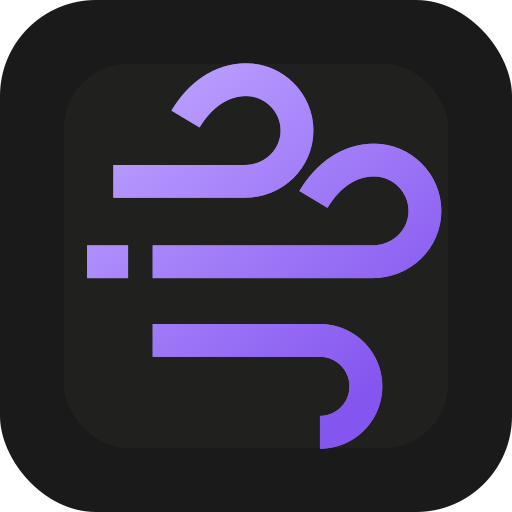

# <picture><source media="(prefers-color-scheme: dark)" srcset="frontend/public/logos/gust-wind-on-void.svg"></picture>

<div align="center">

# Gust

### Your thoughts, captured. Your tasks, organized.

---

<p align="center">

<span style="color:#ba9eff">**The voice-first task manager that turns spoken ideas into organized action.**</span>

</p>

---

[](https://gustapp.ca)
[](https://gustapp.ca)

</div>

---

<p align="center">

<sub>

**[𝕲𝖚𝖘𝖙](https://gustapp.ca)** · *Premium Voice Task Management* · *Powered by AI* · *Works Offline*

</sub>

</p>

---

## 🔮 Features

<div align="center">

| | | | |
|:--:|:--:|:--:|
| 🎙️ | **Voice-First Capture** | Large mic button, screen stays awake, minimal typing required |
| 🤖 | **AI Task Extraction** | Natural language to structured tasks with dates, reminders, subtasks |
| 📱 | **PWA Native Feel** | Install on iOS/Android, works offline, fullscreen experience |
| 🏷️ | **Smart Grouping** | AI routes tasks to the right groups automatically |
| ⚡ | **Confidence Routing** | High-confidence tasks auto-organized, uncertain items flagged for review |
| 📧 | **Daily & Weekly Digests** | Optional email summaries delivered every morning |

</div>

---

## 🚀 How It Works

<div align="center">

```
┌─────────────────────────────────────────────────────────────┐
│                                                             │
│   🎯  TAP          🗣️  SPEAK         ✨  REVIEW        📋  ORGANIZE  │
│   the glowing      naturally about     AI extracts        tasks appear  │
│   mic button        what you need       your tasks         in groups     │
│                                                             │
└─────────────────────────────────────────────────────────────┘
```

**Four steps. Zero friction. All your tasks, organized.**

</div>

---

## 💻 Tech Stack

<div align="center">

### Frontend


### Backend


### AI & Services


</div>

---

## 🎨 Brand Colors

<div align="center">

### The "Digital Void" Palette

| Color | Hex | Usage |
|:-----:|:---:|:------|
|  | `#ba9eff` | **Electric Violet** — Primary accent, CTAs, highlights |
|  | `#fd81a8` | **Soft Pink** — Secondary accent, warmth, notifications |
|  | `#0d0d12` | **Deep Space** — Background, the "void" |
|  | `#f5f5f7` | **Soft White** — Text on dark, cards |
|  | `#6b6b7b` | **Subtle Gray** — Secondary text, borders |

```css
:root {
  --color-electric-violet: #ba9eff;
  --color-soft-pink: #fd81a8;
  --color-deep-space: #0d0d12;
  --color-soft-white: #f5f5f7;
  --color-subtle-gray: #6b6b7b;
}
```

</div>

---

## 🌟 Why Gust?

<div align="center>

> *"The best task manager is the one you actually use."*

</div>

Traditional task apps require you to **stop, open, type, categorize, save** — every single time. That's cognitive overhead you don't need.

**Gust removes the friction:**

- ✋ **One tap to capture** — no app hunting, no keyboard
- 🧠 **Think naturally** — "remind me to call mom tomorrow at 3pm about the birthday party"
- 🤖 **AI handles the structure** — dates, groups, reminders, subtasks all extracted
- 📴 **Works offline** — capture even without internet, sync when you reconnect
- 📱 **Feels native** — install it like an app, runs fullscreen, push notifications

---

## 🚀 Get Started

<div align="center">

### Ready to capture your ideas?

[](https://gustapp.ca)

---

<p align="center">

<sub>

Made with 🎙️ and 🤖 by the Gust team

*© 2024-2026 Gust App · [Privacy](https://gustapp.ca/privacy) · [Terms](https://gustapp.ca/terms)*

</sub>

</p>

</div>

---

<div align="center">


</div>
