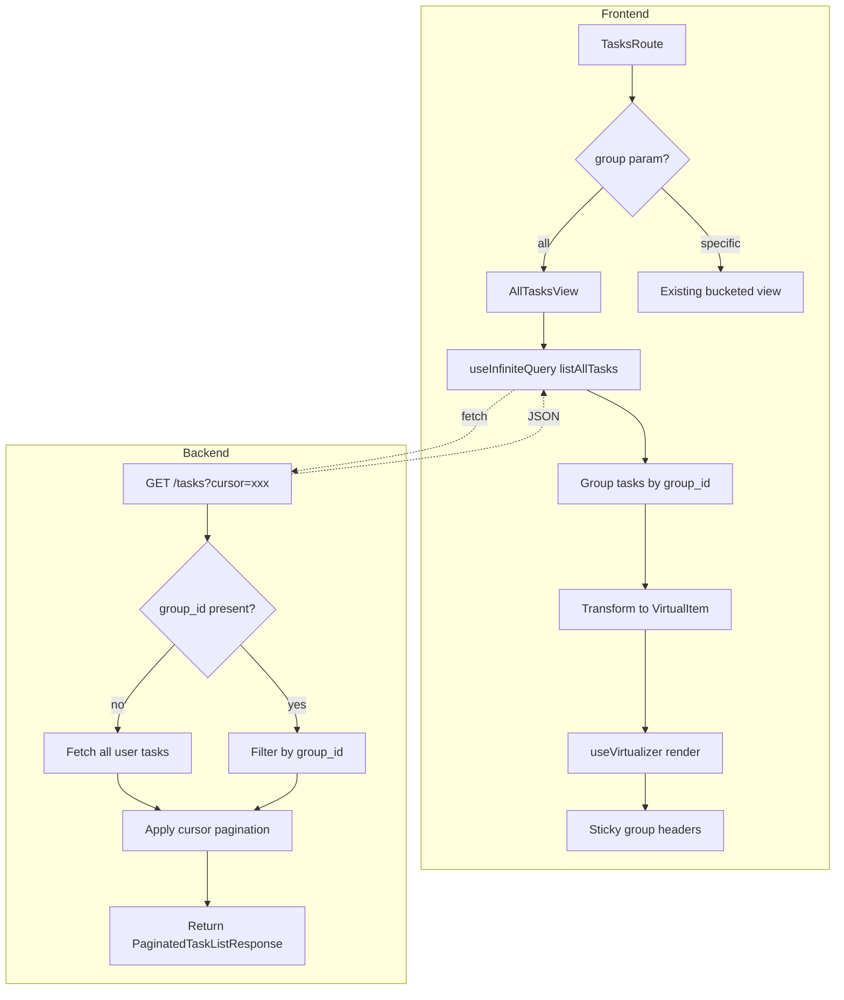

# All Tasks View Implementation Plan v2

**Date:** 2026-03-26  
**Objective:** Implement an "All" view in the tasks interface that aggregates and displays all tasks organized by their respective groups with sticky headers and virtualization for performance.

## Analysis of Existing Plan

The existing plan (v1) is well-structured. However, reviewing the codebase reveals:

### What's Already Done
1. **`listAllTasks()` frontend function exists** in [`api.ts`](frontend/src/lib/api.ts:290) with pagination support
2. **`PaginatedTasksResponse` type exists** in [`api.ts`](frontend/src/lib/api.ts:267) with `items`, `has_more`, `next_cursor`
3. **Frontend already uses `@tanstack/react-query`** with `useInfiniteQuery` patterns

### Key Gaps Identified
1. **Backend route requires `group_id`** - [`GET /tasks`](backend/app/api/routes/tasks.py:88) has `group_id: str = Query(...)` making it required
2. **No cursor-based pagination in backend** - [`list_tasks()`](backend/app/db/repositories.py:595) returns simple `list[TaskRecord]` without pagination
3. **No database index** for efficient cross-group sorting
4. **No `AllTasksView` component** - need to create virtualized view

---

## Independent Plan (v2)

### Phase 1: Backend API Enhancement

#### 1.1 Make `group_id` Optional in Route

**File:** [`backend/app/api/routes/tasks.py`](backend/app/api/routes/tasks.py:88)

```python
@router.get("", response_model=PaginatedTaskListResponse)
def list_tasks_route(
    session_context: OptionalSessionContextDep,
    task_service: TaskServiceDep,
    group_id: Optional[str] = Query(None),  # Changed from required
    status_value: str = Query("open", alias="status"),
    limit: int = Query(50, ge=1, le=100),
    cursor: Optional[str] = Query(None),
) -> PaginatedTaskListResponse:
```

#### 1.2 Add Pagination Response Model

**File:** [`backend/app/api/routes/tasks.py`](backend/app/api/routes/tasks.py)

```python
class PaginatedTaskListResponse(BaseModel):
    items: list[TaskSummaryResponse]
    has_more: bool
    next_cursor: Optional[str]
```

#### 1.3 Repository Pagination Support

**File:** [`backend/app/db/repositories.py`](backend/app/db/repositories.py:595)

Modify `list_tasks()` to:
- Accept `limit: int = 50` and `cursor: Optional[dict]` parameters
- When cursor provided, apply filter conditions for efficient pagination
- Return `tuple[list[TaskRecord], bool, Optional[str]]` (tasks, has_more, next_cursor)

Cursor encoding strategy - base64 JSON:
```python
{
    "group_id": "uuid",
    "due_date": "2026-03-26",
    "created_at": "2026-03-26T10:00:00Z",
    "id": "task_uuid"
}
```

#### 1.4 Database Migration

**File:** `backend/alembic/versions/0007_add_tasks_pagination_index.py`

```sql
CREATE INDEX idx_tasks_user_group_sort 
ON tasks(user_id, group_id, due_date, created_at DESC, id DESC)
WHERE deleted_at IS NULL AND status = 'open';
```

Note: Using DESC for created_at since we sort newest first.

### Phase 2: Frontend API Layer

#### 2.1 Verify `listAllTasks` Implementation

**File:** [`frontend/src/lib/api.ts`](frontend/src/lib/api.ts:290)

The function already exists and is correct. No changes needed.

### Phase 3: AllTasksView Component

#### 3.1 Component Structure

**File:** `frontend/src/components/AllTasksView.tsx`

```typescript
type VirtualItem = 
  | { type: 'header'; groupId: string; groupName: string; taskCount: number }
  | { type: 'task'; task: TaskSummary }

export function AllTasksView({
  onTaskOpen,
  onTaskComplete,
  isBusy
}: AllTasksViewProps) {
  // useInfiniteQuery for paginated task fetching
  // useMemo to group tasks by group_id
  // useVirtualizer for efficient rendering
  // Sticky headers via CSS position: sticky
}
```

#### 3.2 Key Implementation Details

**Grouping Strategy:**
```typescript
const groupedTasks = useMemo(() => {
  const groups = new Map<string, { name: string; tasks: TaskSummary[] }>()
  
  for (const task of allTasks) {
    const existing = groups.get(task.group.id)
    if (existing) {
      existing.tasks.push(task)
    } else {
      groups.set(task.group.id, {
        name: task.group.name,
        tasks: [task]
      })
    }
  }
  
  return groups
}, [allTasks])
```

**Mixed Virtual List:**
- Transform flat paginated list into `VirtualItem[]`
- Headers are fixed height (~48px)
- Task cards are fixed height (~100px) - same as SwipeTaskCard
- use `getItemKey(index)` to distinguish: `header-${groupId}` vs `task-${taskId}`

**Sticky Headers:**
```css
.group-header {
  position: sticky;
  top: 0;
  z-index: 10;
  background: var(--surface-color);
}
```

### Phase 4: Integration

#### 4.1 TasksRoute Changes

**File:** [`frontend/src/routes/TasksRoute.tsx`](frontend/src/routes/TasksRoute.tsx:383)

Add "All" tab alongside group tabs:

```tsx
{/* Existing group tabs */}
{groupsQuery.data.map((group) => (
  <button
    key={group.id}
    onClick={() => setSearchParams({ group: group.id })}
    className={...}
  >
    {group.name} · {group.open_task_count}
  </button>
))}

{/* New All tab */}
<button
  onClick={() => setSearchParams({ group: 'all' })}
  className={selectedGroupId === 'all' ? '...' : '...'}
/>
  All
</button>
```

Conditional rendering:
```tsx
{selectedGroupId === 'all' ? (
  <AllTasksView
    onTaskOpen={(id) => navigate(`/tasks/${id}`)}
    onTaskComplete={handleComplete}
    isBusy={isBusy}
  />
) : (
  // Existing bucketed view
)}
```

### Phase 5: Edge Cases & Empty States

1. **Empty state:** Show friendly message "No tasks across any group"
2. **Loading state:** Skeleton loaders for first page
3. **Group with 0 tasks:** Skip rendering that group's header
4. **Many groups with few tasks:** Ensure virtualization still provides benefit
5. **Rapid page loads:** Debounce/prevent overlapping fetches

---

## Mermaid Diagram



---

## Rollout Plan

1. **Backend migration** - Add pagination index
2. **Backend route** - Make group_id optional, add pagination params
3. **Repository layer** - Implement cursor-based pagination
4. **Service layer** - Propagate pagination
5. **Frontend API** - Verify listAllTasks works
6. **AllTasksView component** - Create virtualized component
7. **TasksRoute integration** - Add "All" tab
8. **Testing** - Manual + automated tests
9. **Documentation** - Update docs if needed

---

## Differences from v1 Plan

| Aspect | v1 Plan | v2 Plan (This) |
|--------|---------|----------------|
| Frontend API | Suggested adding `listAllTasks` | Already exists, no change needed |
| Pagination cursor | Suggested | Confirmed approach (group_id + due_date + created_at + id) |
| Virtualization | @tanstack/react-virtual | Confirmed same |
| Component structure | AllTasksView suggested | Same, more detailed implementation |
| Database index | Mentioned | Added DESC for created_at |

---

## Confidence Assessment

**Confidence: 85%**

This plan is based on thorough analysis of existing code. The main uncertainties are:
- Whether the existing `listAllTasks` pagination pattern works correctly with the backend
- Whether virtualization height assumptions (100px task cards) are accurate

**Information that would increase confidence:**
- Backend service layer `list_tasks` implementation to confirm pagination can be added
- Confirmation of any existing database indexes on tasks table
