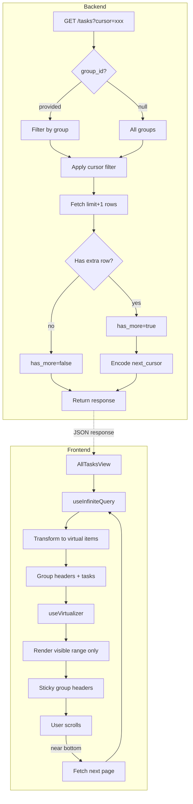

# All Tasks View Implementation Plan

**Date:** 2026-03-26  
**Objective:** Implement an "All" view in the tasks interface that aggregates and displays all tasks organized by their respective groups, with virtualization for performance.

## Architecture Overview

### Current State
- Tasks fetched per-group via `GET /tasks?group_id=xxx&status=open`
- Group tabs allow switching between groups
- Tasks displayed in bucketed sections (overdue, due_soon, no_date)

### Proposed Solution
Add an "All" tab that shows tasks from all groups, organized by group with sticky headers.

## Implementation Phases

### Phase 1: Backend Changes

#### 1.1 Repository Layer (`backend/app/db/repositories.py`)

Modify `list_tasks()` function to:
- Make `group_id` parameter optional (when None, fetch all user tasks)
- Add pagination parameters: `limit: int = 50`, `cursor: Optional[str] = None`
- Return total count for pagination metadata
- Sort by `group_id`, `due_date`, `created_at` for consistent ordering

```python
def list_tasks(
    connection: Connection,
    *,
    user_id: str,
    group_id: Optional[str] = None,
    status: str = "open",
    include_deleted: bool = False,
    limit: int = 50,
    cursor: Optional[str] = None,
) -> tuple[list[TaskRecord], bool, Optional[str]]:
    """Returns (tasks, has_more, next_cursor)"""
```

#### 1.2 Service Layer (`backend/app/services/task_service.py`)

Update `TaskService.list_tasks()` to:
- Accept pagination parameters
- Return paginated response with metadata

```python
def list_tasks(
    self,
    *,
    user_id: str,
    user_timezone: str,
    group_id: Optional[str] = None,
    status: str = "open",
    limit: int = 50,
    cursor: Optional[str] = None,
) -> PaginatedTaskList:
```

#### 1.3 API Route (`backend/app/api/routes/tasks.py`)

Update `GET /tasks` endpoint:
- Make `group_id` optional query parameter
- Add `limit` and `cursor` query parameters
- Return paginated response structure

Response format:
```json
{
  "items": [...],
  "has_more": true,
  "next_cursor": "encoded_cursor_string"
}
```

#### 1.4 Database Migration

Add composite index for efficient pagination:
```sql
CREATE INDEX idx_tasks_user_group_sort 
ON tasks(user_id, group_id, due_date, created_at, id)
WHERE deleted_at IS NULL AND status = 'open';
```

### Phase 2: Frontend Changes

#### 2.1 Dependencies

Add to `frontend/package.json`:
```json
"@tanstack/react-virtual": "^3.0.0"
```

#### 2.2 API Layer (`frontend/src/lib/api.ts`)

New types and function:
```typescript
export type PaginatedTaskResponse = {
  items: TaskSummary[]
  has_more: boolean
  next_cursor: string | null
}

export function listAllTasks(
  statusValue: 'open' | 'completed' = 'open',
  cursor: string | null = null,
  limit: number = 50
): Promise<PaginatedTaskResponse>
```

#### 2.3 AllTasksView Component

New component: `frontend/src/components/AllTasksView.tsx`

Features:
- Uses `@tanstack/react-virtual` for virtualization
- Groups tasks by `group.name` with sticky headers
- Mixed virtual list (headers + task items)
- Infinite scroll via `useInfiniteQuery`
- Task completion with optimistic updates

Virtualization Strategy:
- Each group header is a virtual item (fixed height ~40px)
- Each task card is a virtual item (fixed height ~100px)
- Total virtual items = sum of all groups + sum of all tasks
- `getItemKey` distinguishes headers from tasks

#### 2.4 Integration in TasksRoute

Modify `TasksRoute.tsx`:
- Add "All" tab button alongside group tabs
- Conditional rendering: group view vs All view
- Shared undo/completion handling

### Phase 3: Virtualization Implementation Details

#### Mixed Item Type Virtualization

The virtual list needs to handle two types of items:
1. **Group Headers** - Sticky section headers showing group name
2. **Task Cards** - The actual task items

Approach:
```typescript
type VirtualItem = 
  | { type: 'header'; groupId: string; groupName: string }
  | { type: 'task'; task: TaskSummary }

// Transform flat task list into mixed virtual items
const virtualItems = useMemo(() => {
  const items: VirtualItem[] = []
  Object.entries(groupedTasks).forEach(([groupId, groupTasks]) => {
    items.push({ type: 'header', groupId, groupName: groupTasks[0].group.name })
    groupTasks.forEach(task => items.push({ type: 'task', task }))
  })
  return items
}, [groupedTasks])
```

#### Sticky Headers Implementation

Use CSS `position: sticky` on group headers within the virtual container:
```css
.group-header {
  position: sticky;
  top: 0;
  z-index: 10;
  background: var(--surface-color);
}
```

### Phase 4: State Management

#### Query Keys

```typescript
// Infinite query for all tasks
const allTasksQuery = useInfiniteQuery({
  queryKey: ['tasks', 'all', 'open'],
  queryFn: ({ pageParam }) => listAllTasks('open', pageParam),
  getNextPageParam: (lastPage) => lastPage.next_cursor,
  initialPageParam: null as string | null,
})
```

#### Mutation Handling

Task completion in All view:
- Optimistically remove from list
- Show undo toast
- Invalidate queries on undo

### Phase 5: Testing & Performance

#### Performance Targets
- First paint: < 100ms (virtualization)
- Scroll performance: 60fps
- Initial load: < 500ms for first 50 tasks
- Subsequent page loads: < 300ms

#### Test Scenarios
1. Empty state (no tasks)
2. Single group with many tasks
3. Many groups with few tasks each
4. Rapid scrolling through large dataset
5. Task completion/undo in All view
6. Switching between All and group-specific views

## Cursor-Based Pagination

Cursor format (base64 encoded JSON):
```json
{
  "group_id": "uuid",
  "due_date": "2026-03-26",
  "created_at": "2026-03-26T10:00:00Z",
  "id": "task_uuid"
}
```

Benefits:
- Consistent ordering even with new inserts
- No offset calculation overhead
- Works well with composite sorting

## Mermaid Diagram



## Rollout Plan

1. Backend API changes (no breaking changes - group_id remains required initially)
2. Database migration for index
3. Frontend dependency installation
4. Frontend API function
5. AllTasksView component
6. TasksRoute integration
7. Testing & refinement
8. Update documentation

## Open Questions

None - all clarifications received.
