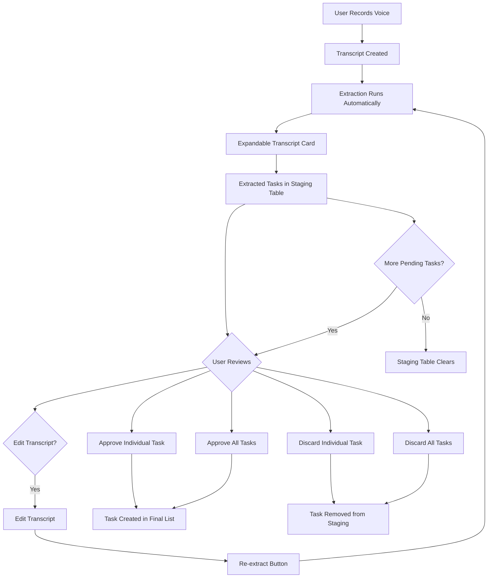
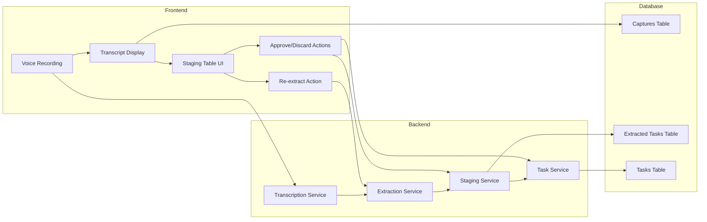
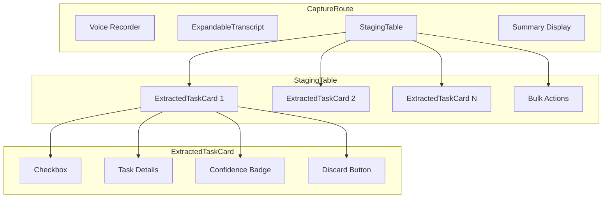
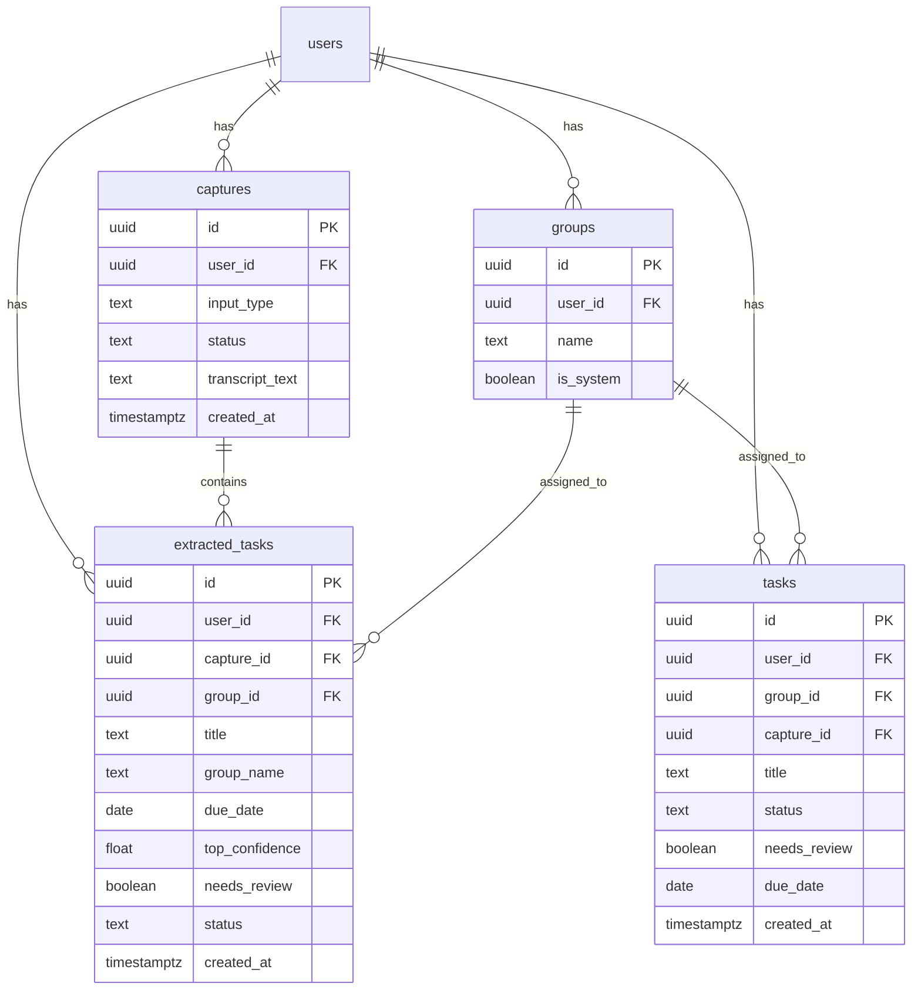
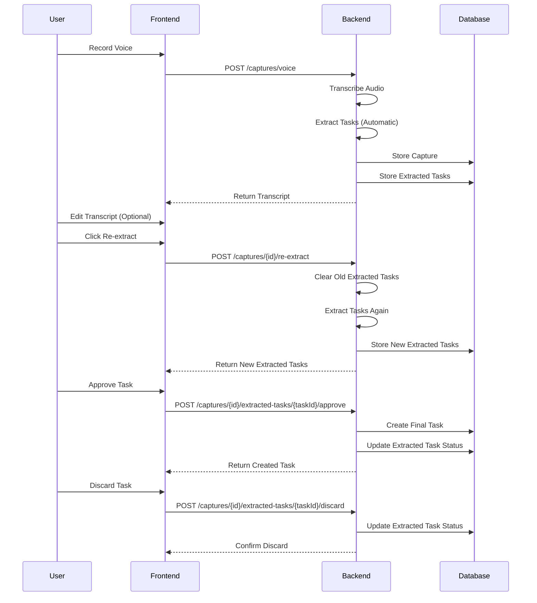
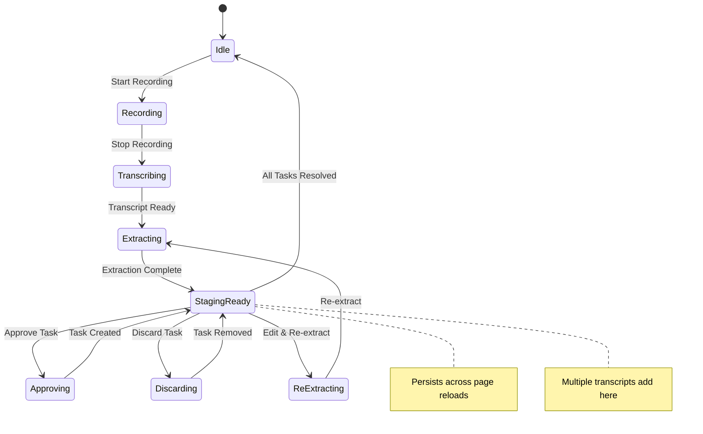
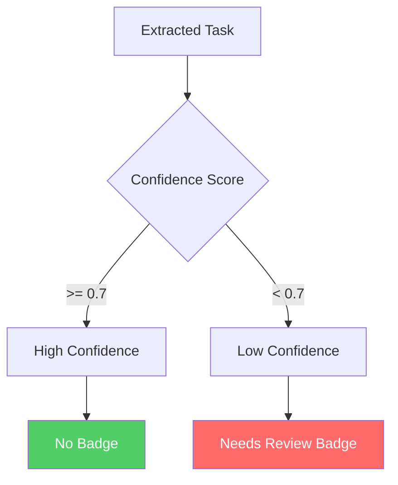
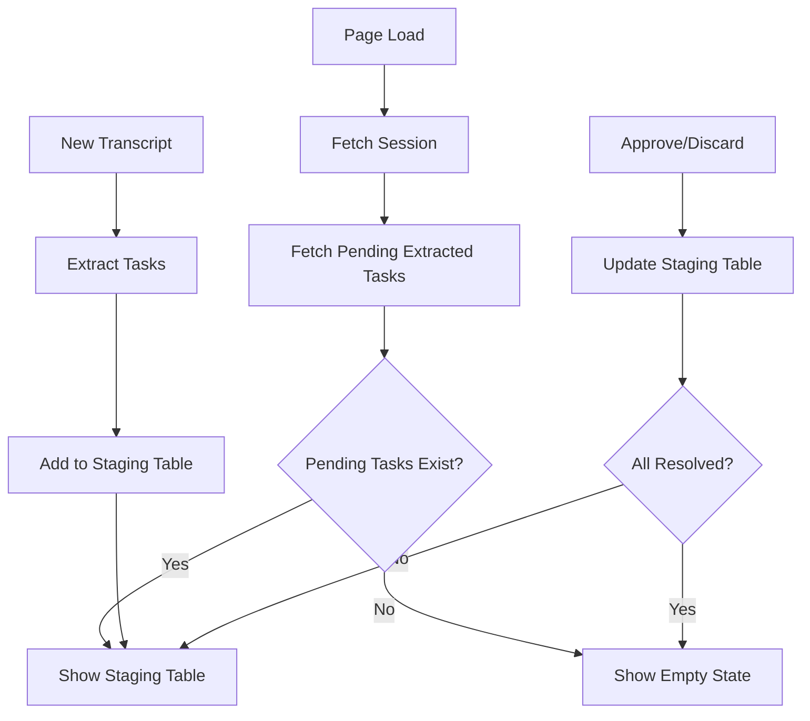

# Capture Staging Workflow - Visual Diagrams

## User Flow Diagram

## Data Flow Diagram

## Component Architecture

## Database Schema Diagram

## API Endpoint Flow

## State Management

## Confidence Badge Logic

## Persistence Strategy

