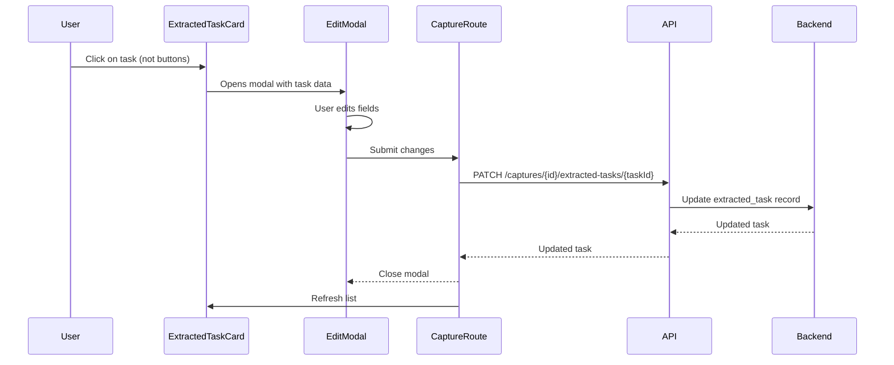

# Extracted Task Edit Modal - Implementation Plan

## Overview
Modify the capture page's extracted tasks UI to:
1. Show a recurring indicator icon when a task has `recurrence_frequency`
2. Remove inline due date editing
3. Click on a task (not approve/discard buttons) opens an edit modal
4. Modal allows editing all task fields before approval
5. Condensed view when not clicking into a task

## Architecture Diagram



## Backend Changes

### 1. Expand `UpdateExtractedTaskRequest` (backend/app/api/routes/captures.py)

**Current:**
```python
class UpdateExtractedTaskRequest(BaseModel):
    due_date: Optional[date] = None
```

**New:**
```python
class UpdateExtractedTaskRequest(BaseModel):
    title: Optional[str] = None
    group_id: Optional[str] = None
    due_date: Optional[date] = None
    reminder_at: Optional[str] = None  # ISO datetime or null
    recurrence_frequency: Optional[str] = None  # none, daily, weekly, monthly, yearly
    recurrence_weekday: Optional[int] = None  # 0-6 for weekly
    recurrence_day_of_month: Optional[int] = None  # 1-31 for monthly
```

### 2. Update PATCH endpoint (backend/app/api/routes/captures.py)

Update `update_extracted_task` to pass all fields to the service layer.

### 3. Update StagingService (backend/app/services/staging.py)

Add a new method `update_extracted_task` that updates all fields, or modify `update_task_due_date` to accept more parameters.

### 4. Update Repository (backend/app/db/repositories.py)

Add repository method to update extracted task fields in the database.

## Frontend Changes

### 1. Create EditExtractedTaskModal Component (frontend/src/components/EditExtractedTaskModal.tsx)

**Props:**
```typescript
interface EditExtractedTaskModalProps {
  task: ExtractedTask
  groups: Group[]
  isOpen: boolean
  onClose: () => void
  onSave: (taskId: string, updates: ExtractedTaskUpdates) => Promise<void>
}
```

**Modal Fields:**
- **Title**: Text input
- **Group**: Dropdown select from user's groups
- **Due Date**: Date picker
- **Reminder**: Toggle switch (on/off)
- **Recurrence**: 
  - Frequency: Dropdown (none, daily, weekly, monthly, yearly)
  - Weekday: Dropdown (0-6) - shown when weekly
  - Day of Month: Number input (1-31) - shown when monthly

### 2. Modify ExtractedTaskCard (frontend/src/components/ExtractedTaskCard.tsx)

**Changes:**
- Remove inline due date editing (remove `isEditingDueDate` state and handlers)
- Add recurring indicator icon (🔁 or similar) when `recurrence_frequency` is set
- Make card clickable (use `onClick` on wrapper div)
- Stop propagation on approve/discard buttons to prevent modal opening
- Condensed view shows: title, recurring icon, due date (not editable), group, confidence

**New Props:**
```typescript
interface ExtractedTaskCardProps {
  task: ExtractedTask
  onApprove: (taskId: string) => void
  onDiscard: (taskId: string) => void
  onClick: (task: ExtractedTask) => void  // New - opens modal
}
```

### 3. Update StagingTable (frontend/src/components/StagingTable.tsx)

**Changes:**
- Pass `onClick` handler to ExtractedTaskCard
- Accept and pass groups array for the modal

### 4. Update CaptureRoute (frontend/src/routes/CaptureRoute.tsx)

**Changes:**
- Add `updateExtractedTask` API function call
- Pass groups to StagingTable
- Handle modal open/close state
- Query user's groups for the dropdown

### 5. Add API function (frontend/src/lib/api.ts)

```typescript
export type ExtractedTaskUpdates = {
  title?: string
  group_id?: string
  due_date?: string | null
  reminder_at?: string | null
  recurrence_frequency?: string | null
  recurrence_weekday?: number | null
  recurrence_day_of_month?: number | null
}

export async function updateExtractedTask(
  captureId: string,
  taskId: string,
  updates: ExtractedTaskUpdates,
  csrfToken: string
): Promise<ExtractedTask> {
  // ... implementation
}
```

## UI/UX Details

### Condensed Card View (default)
```
┌─────────────────────────────────────────────────────────────┐
│ 🔁 Task Title Here                              [Approve]   │
│     Group Name | Due: Mar 25 | Confidence: High             │
│                                         [Discard]           │
└─────────────────────────────────────────────────────────────┘
```

### Edit Modal
```
┌─────────────────────────────────────────────────────────────┐
│ Edit Task                                              ✕    │
├─────────────────────────────────────────────────────────────┤
│ Title                                                        │
│ ┌─────────────────────────────────────────────────────────┐ │
│ │ Task title here                                         │ │
│ └─────────────────────────────────────────────────────────┘ │
│                                                             │
│ Group                                                        │
│ ┌─────────────────────────────────────────────────────────┐ │
│ │ Dropdown with user's groups                             │ │
│ └─────────────────────────────────────────────────────────┘ │
│                                                             │
│ Due Date                                                     │
│ ┌─────────────────────────────────────────────────────────┐ │
│ │ 2026-03-25                                              │ │
│ └─────────────────────────────────────────────────────────┘ │
│                                                             │
│ Reminder  [====|====] On                                    │
│                                                             │
│ Recurrence                                                   │
│ ┌─────────────────────────────────────────────────────────┐ │
│ │ Frequency: [Monthly ▼]                                   │ │
│ │ Day of Month: [15]                                       │ │
│ └─────────────────────────────────────────────────────────┘ │
│                                                             │
│                              [Cancel]  [Save Changes]       │
└─────────────────────────────────────────────────────────────┘
```

## Files to Modify

| File | Changes |
|------|---------|
| `backend/app/api/routes/captures.py` | Expand UpdateExtractedTaskRequest, update PATCH handler |
| `backend/app/services/staging.py` | Add update_extracted_task method |
| `backend/app/db/repositories.py` | Add repository method for updating extracted task |
| `frontend/src/lib/api.ts` | Add updateExtractedTask function and ExtractedTaskUpdates type |
| `frontend/src/components/ExtractedTaskCard.tsx` | Remove inline edit, add recurring icon, add onClick |
| `frontend/src/components/StagingTable.tsx` | Pass onClick and groups props |
| `frontend/src/components/EditExtractedTaskModal.tsx` | **NEW** - Modal component |
| `frontend/src/routes/CaptureRoute.tsx` | Add modal state, groups query, wire up updates |

## Implementation Order

1. **Backend API** (backend/app/api/routes/captures.py)
   - Expand `UpdateExtractedTaskRequest` model
   - Update PATCH endpoint to pass all fields

2. **Backend Service** (backend/app/services/staging.py)
   - Add `update_extracted_task` method to handle multiple field updates

3. **Backend Repository** (backend/app/db/repositories.py)
   - Add repository method to update extracted task in DB

4. **Frontend API** (frontend/src/lib/api.ts)
   - Add `updateExtractedTask` function
   - Add `ExtractedTaskUpdates` type

5. **Frontend Modal** (frontend/src/components/EditExtractedTaskModal.tsx)
   - Create new modal component

6. **Frontend Card** (frontend/src/components/ExtractedTaskCard.tsx)
   - Remove inline due date editing
   - Add recurring icon
   - Add onClick handler with stop propagation on buttons

7. **Frontend Table** (frontend/src/components/StagingTable.tsx)
   - Update to pass groups and onClick

8. **Frontend Route** (frontend/src/routes/CaptureRoute.tsx)
   - Add modal state management
   - Query user's groups
   - Wire up save handler

## Testing Considerations

- Verify modal pre-populates with correct task values
- Verify all fields can be edited and saved
- Verify clicking approve/discard does NOT open modal
- Verify clicking elsewhere on card DOES open modal
- Verify recurring icon appears when recurrence_frequency is set
- Verify due date displays but is not editable inline
- Verify group dropdown shows all user's groups
- Verify frequency/weekday/day_of_month fields show/hide based on frequency selection
