# Extracted Tasks Section UI Fix Plan

## Summary of Issues to Address

1. **Flickering issue** in the extracted tasks section
2. **Duplicate headers** (one in CaptureRoute, one in StagingTable)
3. **Clashing button colors** (green-600, red-600 too saturated)
4. **Green/red colors too prominent** throughout the interface
5. **Missing grouping view toggle** functionality
6. **Missing due date editing** functionality
7. **"Review transcript" text** above mic button needs removal

---

## Files to Modify

| File | Changes |
|------|---------|
| `frontend/src/routes/CaptureRoute.tsx` | Remove duplicate header, remove "Review transcript" text |
| `frontend/src/components/StagingTable.tsx` | Add grouping toggle, refactor header handling |
| `frontend/src/components/ExtractedTaskCard.tsx` | Add due date edit, update button colors |
| `frontend/src/styles.css` | Update green/red color palette to align with theme |
| `frontend/tailwind.config.ts` | Update green/red color mappings |

---

## Detailed Implementation Plan

### 1. Remove Duplicate Headers

**Problem:** The extracted tasks section has redundant headers:
- `CaptureRoute.tsx` lines 451-460: Shows "Extracted Tasks" and "Review and approve tasks"
- `StagingTable.tsx` line 58: Shows "Extracted Tasks (N)"

**Solution:** 
- Remove the header section from `CaptureRoute.tsx` (lines 451-460)
- Keep only the header in `StagingTable.tsx` and ensure it displays appropriate info

### 2. Remove "Review transcript" Text

**Problem:** Line 336-343 in `CaptureRoute.tsx` displays "Review transcript" above the mic button when `reviewCaptureId` is set.

**Solution:**
- Remove the conditional text display that shows "Review transcript"
- Keep only "Recording...", "Transcribing...", or "Ready to capture" states

### 3. Update Green/Red Color Palette

**Problem:** Buttons use Tailwind's `green-600` (`#16a34a`) and `red-600` (`#dc2626`) which clash with the violet/purple theme.

**Current palette:**
```css
--color-success: #66bb6a;
--color-success-dim: #4caf50;
--color-error: #ef5350;
--color-error-dim: #e53935;
```

**Solution:**
- Update `--color-success` to a more muted, purple-compatible green: `#4ade80` → `rgba(74, 222, 128, 0.15)` for backgrounds, `text-[#4ade80]` for text
- Update `--color-error` to a more muted, purple-compatible red: `#f87171` for text, `rgba(248, 113, 113, 0.15)` for backgrounds
- Update Tailwind config to use these softer colors for approve/discard buttons

### 4. Update Button Styling

**ExtractedTaskCard.tsx:**
- Change `bg-green-600 hover:bg-green-700` → `bg-primary/20 hover:bg-primary/30 text-primary border border-primary/30`
- Change `bg-red-600 hover:bg-red-700` → `bg-tertiary/10 hover:bg-tertiary/20 text-tertiary border border-tertiary/20`

**StagingTable.tsx:**
- Same approve/discard button color updates

### 5. Add Grouping View Toggle

**New Feature:** Allow users to toggle how extracted tasks are grouped/displayed.

**Options:**
- **No grouping** - Flat list (current behavior)
- **By Group** - Group tasks by their `group_name`
- **By Confidence** - Group by High/Medium/Low confidence
- **Needs Review First** - Sort tasks with `needs_review: true` at top

**Implementation:**
- Add a toggle/segmented control in `StagingTable.tsx` header area
- Create grouping logic that organizes `pendingTasks` array before rendering
- Use subtle badges instead of full headers for groups

### 6. Add Due Date Editing

**New Feature:** Allow users to modify `due_date` directly from `ExtractedTaskCard`.

**Implementation:**
- Add a small calendar/date picker input in the card
- Add `onDueDateChange` callback prop to `ExtractedTaskCard`
- Add API function `updateExtractedTaskDueDate(captureId, taskId, dueDate, csrfToken)` to `lib/api.ts`
- Update staging service endpoint if needed (may need backend support)

### 7. Fix Flickering

**Problem:** The 2-second polling interval (`refetchInterval: 2000`) and state syncing causes flickering.

**Solution:**
- Add a debounce or minimum display time before state updates
- Use React state more carefully to prevent unnecessary re-renders
- Consider using `keepPreviousData` from React Query to prevent flash of empty state

---

## Mermaid Diagram: Component Structure After Changes

```mermaid
graph TD
    A[CaptureRoute] --> B[StagingTable]
    B --> C[ExtractedTaskCard]
    B --> D[GroupingToggle]
    
    subgraph StagingTable
        E[Header: Title + Count] --> F[GroupingToggle]
        F --> G[Task List Area]
    end
    
    subgraph ExtractedTaskCard
        H[Title + Badge] --> I[Metadata Row]
        I --> J[Due Date Picker]
        I --> K[Confidence Indicator]
        J --> L[Approve/Discard Buttons]
    end
    
    style A fill:#1a1a1a
    style B fill:#1a1a1a
    style C fill:#20201f
```



---

## Implementation Order

1. **Phase 1: Quick Fixes**
   - Remove duplicate headers in `CaptureRoute.tsx`
   - Remove "Review transcript" text
   - Fix button colors to use theme-compatible shades

2. **Phase 2: Color Palette Update**
   - Update `styles.css` with softer green/red
   - Update `tailwind.config.ts` color mappings

3. **Phase 3: New Features**
   - Add grouping toggle to `StagingTable.tsx`
   - Add due date picker to `ExtractedTaskCard.tsx`
   - Add API function for due date updates

4. **Phase 4: Polish**
   - Fix flickering with proper state management
   - Test all interactions
