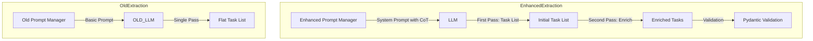

# Extraction Improvement Plan

## Problem Statement

The current task extraction system fails to properly decompose transcripts containing multiple related tasks and their subtasks. Testing with the sample transcript reveals:

**Sample Transcript:**
```
So I need to create a resume for AI product manager and start applying to some jobs using it to do that. I need to fix up my resume, do some research on what skills they should have and maybe upskill my skills too. And also I should uh I gotta call my dentist to probably tomorrow. Um around 9 a.m. to fix my metal thing in my mouth. Yeah.
```

**Expected Extraction (3 tasks with subtasks):**
1. **Task**: "Create resume for AI product manager"
   - **Subtask**: "Fix up my resume"
   - **Subtask**: "Do some research on what skills they should have"
   - **Subtask**: "Upskill my skills"
2. **Task**: "Apply to AI product manager jobs"
3. **Task**: "Call dentist tomorrow at 9am to fix metal thing in mouth" (with reminder)

**Actual Extraction (current behavior):**
- Only extracts the first task "Create a resume for AI job"
- Missing all subtasks
- Missing the "Apply to jobs" task
- Missing the dentist call task

## Root Cause Analysis

### 1. System Prompt Deficiencies

The current system prompt at [`backend/app/prompts/extraction_prompts.py:11-74`](backend/app/prompts/extraction_prompts.py:11) has these issues:

| Issue | Current Text | Problem |
|-------|--------------|---------|
| Generic subtask instruction | "5. Include subtasks when mentioned in the transcript" | Model doesn't understand hierarchical vs flat task decomposition |
| No task boundary guidance | None | Model doesn't know how to identify distinct tasks |
| No sequential language handling | None | "and then", "also", "too" patterns aren't explained |
| Single JSON example | Simple grocery example | Doesn't show complex multi-task decomposition |
| No confidence calibration | "top_confidence for each task" | Model can't judge its own uncertainty |

### 2. Single-Pass Extraction Architecture

The current architecture expects the LLM to:
1. Parse the transcript
2. Identify all tasks
3. Identify subtasks within tasks
4. Assign groups
5. Extract dates/reminders
6. Score confidence

All in one pass without explicit reasoning steps.

### 3. Missing Explicit Examples

The prompt only includes one JSON example showing simple subtasks, but doesn't demonstrate:
- How to handle "research X and then do Y" patterns
- When to create separate tasks vs. subtasks
- How to recognize time-bound tasks vs. project tasks

## Proposed Solution

### Approach: Enhanced System Prompt with Chain-of-Thought Examples

We will improve extraction by enhancing the system prompt with:

1. **Step-by-step extraction instructions** - Guide the model through a reasoning process
2. **Multiple comprehensive examples** - Show complex decompositions
3. **Clear task boundary rules** - Define what constitutes a new task vs. subtask
4. **Signal word handling** - Explicitly handle "and", "also", "too", "and then"
5. **Self-verification step** - Ask model to check its work

### Architecture Diagram



## Detailed Design

### 1. Enhanced System Prompt Structure

```python
# New system prompt sections:

SYSTEM_PROMPT_SECTIONS = """
1. ROLE: You are a meticulous task extraction assistant for Gust...
2. EXTRACTION STRATEGY: Follow these steps for each transcript...
3. TASK BOUNDARY RULES: Define when to create new tasks vs subtasks...
4. SIGNAL WORD HANDLING: Handle connecting words...
5. EXAMPLES: Multiple comprehensive examples...
6. SELF-VERIFICATION: Check your work before returning...
7. OUTPUT SCHEMA: The exact JSON format required...
"""
```

### 2. Step-by-Step Extraction Strategy

Add explicit instructions for a reasoning approach:

```
EXTRACTION STRATEGY:
1. FIRST PASS - Identify all potential tasks:
   - Read the transcript completely
   - List every actionable item you can identify
   - Mark items that seem related (candidate subtasks)
   
2. SECOND PASS - Determine task hierarchy:
   - For each potential task, decide: is this a main task or a subtask?
   - Subtask criteria: requires completion BEFORE or AS PART OF another task
   - Main task criteria: stands alone, could be done independently
   
3. THIRD PASS - Group assignment and metadata:
   - Assign groups based on context
   - Extract dates, reminders, recurrence
   - Score confidence for each
   
4. FOURTH PASS - Self-verification:
   - Check: did I capture ALL actionable items?
   - Check: are subtasks properly nested under parent tasks?
   - Check: are there any time-bound tasks I might have missed?
```

### 3. Task Boundary Rules

Explicit rules for distinguishing tasks vs subtasks:

```
TASK vs SUBTASK DECISION RULES:

A subtask is appropriate when:
- It represents a discrete step toward completing a larger goal
- It would be meaningless or incomplete without the parent task
- Example: "fix up my resume" is a subtask of "create resume for AI job"
- Example: "buy ingredients" is a subtask of "make dinner"

A new main task is appropriate when:
- It has independent value - you could complete it without another task
- It uses different tools, context, or timeframe
- It could appear in a to-do list without needing parent context
- Example: "call dentist tomorrow at 9am" is independent of resume work
- Example: "apply to jobs" could stand alone (though related)

CRITICAL: When in doubt, prefer creating separate tasks rather than subtasks.
It's easier for users to merge tasks than to un-nest subtasks.
```

### 4. Signal Word Handling

```
SIGNAL WORDS AND PHRASES:

"and" / "also" / "too":
- Usually introduces a NEW MAIN TASK (parallel actions)
- "I need to fix the sink AND call the plumber" = 2 separate tasks

"and then" / "after that" / "before that":
- Usually introduces a SUBTASK or SEQUENTIAL TASK
- "Research companies and then apply" = subtask if same project

"so I need to" / "I gotta" / "I should":
- Introduces a new main task

"I need to X to do Y":
- X is likely a SUBTASK of Y
- "Fix up my resume to apply to jobs" = subtask

Specific patterns:
- "I need to [verb] my [noun]" often = main task
- "do some [noun]" often = main task  
- "maybe [verb]" = optional task, still extract it
```

### 5. Comprehensive Examples

Add multiple examples showing different extraction scenarios:

```json
// Example 1: Multi-task with subtasks (THE TEST CASE)
{
  "transcript": "So I need to create a resume for AI product manager and start applying to some jobs using it to do that. I need to fix up my resume, do some research on what skills they should have and maybe upskill my skills too. And also I should uh I gotta call my dentist to probably tomorrow. Um around 9 a.m. to fix my metal thing in my mouth. Yeah.",
  "tasks": [
    {
      "title": "Create resume for AI product manager",
      "due_date": null,
      "reminder_at": null,
      "group_name": "Work",
      "top_confidence": 0.92,
      "alternative_groups": [{"group_name": "Inbox", "confidence": 0.15}],
      "recurrence": null,
      "subtasks": [
        {"title": "Fix up my resume"},
        {"title": "Do some research on what skills they should have"},
        {"title": "Upskill my skills"}
      ]
    },
    {
      "title": "Apply to AI product manager jobs",
      "due_date": null,
      "reminder_at": null,
      "group_name": "Work",
      "top_confidence": 0.88,
      "alternative_groups": [],
      "recurrence": null,
      "subtasks": []
    },
    {
      "title": "Call dentist to fix metal thing in mouth",
      "due_date": "2026-03-25",
      "reminder_at": "2026-03-25T09:00:00",
      "group_name": "Personal",
      "top_confidence": 0.95,
      "alternative_groups": [],
      "recurrence": null,
      "subtasks": []
    }
  ]
}

// Example 2: "And" introduces separate tasks
{
  "transcript": "I need to buy groceries and call my mom and schedule a dentist appointment",
  "tasks": [
    {"title": "Buy groceries", "subtasks": []},
    {"title": "Call my mom", "subtasks": []},
    {"title": "Schedule dentist appointment", "subtasks": []}
  ]
}

// Example 3: Subtask reasoning
{
  "transcript": "I want to learn guitar I need to buy one first and find a teacher",
  "tasks": [
    {
      "title": "Learn guitar",
      "subtasks": [
        {"title": "Buy a guitar"},
        {"title": "Find a teacher"}
      ]
    }
  ]
}

// Example 4: Independent tasks with "also"
{
  "transcript": "I should finish the report today and also water the plants and call John back",
  "tasks": [
    {"title": "Finish the report", "due_date": "TODAY"},
    {"title": "Water the plants", "subtasks": []},
    {"title": "Call John back", "subtasks": []}
  ]
}
```

### 6. Self-Verification Checklist

Add to the prompt:

```
BEFORE RETURNING YOUR RESPONSE, VERIFY:

□ I have identified ALL actionable items in the transcript
□ Each subtask is truly a sub-step of its parent task
□ I have not created subtasks that could stand alone as separate tasks
□ All mentioned time/date information is captured (due_date or reminder_at)
□ Tasks that could be grouped are grouped together
□ If I was unsure about something, my confidence score reflects that
□ I have not invented groups - I only used available groups or Inbox
```

## Implementation Plan

### Phase 1: Prompt Enhancement (Low Risk)

Modify [`backend/app/prompts/extraction_prompts.py`](backend/app/prompts/extraction_prompts.py):

1. Add `get_extraction_strategy()` method with step-by-step instructions
2. Add `get_task_boundary_rules()` method 
3. Add `get_signal_word_handling()` method
4. Add `get_self_verification_checklist()` method
5. Add multiple comprehensive examples to `get_system_prompt()`
6. Keep backward compatibility with existing interface

### Phase 2: Testing (Medium Effort)

1. Add integration tests with the sample transcript
2. Test edge cases:
   - Multiple parallel tasks
   - Nested subtasks (single level only per PRD)
   - Tasks with and without reminders
   - Empty or minimal transcripts
   - High-confidence vs low-confidence scenarios

### Phase 3: Validation Enhancement (If Needed)

If prompt changes aren't sufficient, consider:

1. **Two-pass extraction**: First pass identifies task list, second pass enriches with metadata
2. **Chain-of-thought prompting**: Ask model to explain its reasoning
3. **Ensemble extraction**: Run multiple times and reconcile differences

## Files to Modify

| File | Changes |
|------|---------|
| `backend/app/prompts/extraction_prompts.py` | Complete rewrite of system prompt with enhanced guidance |
| `backend/tests/test_provider_services.py` | Add tests with comprehensive examples |

## Success Criteria

After implementation:

1. ✅ The sample transcript extracts ALL 3 tasks
2. ✅ The first task includes ALL 3 subtasks
3. ✅ The dentist task includes the reminder at 9am tomorrow
4. ✅ No invented groups - uses available groups or Inbox
5. ✅ Confidence scores are appropriately calibrated
6. ✅ Existing tests continue to pass

## Estimated Changes

- **Code changes**: ~200 lines modified in `extraction_prompts.py`
- **New tests**: ~100 lines in `test_provider_services.py`
- **Risk level**: Low (only prompt changes, no architectural changes)
