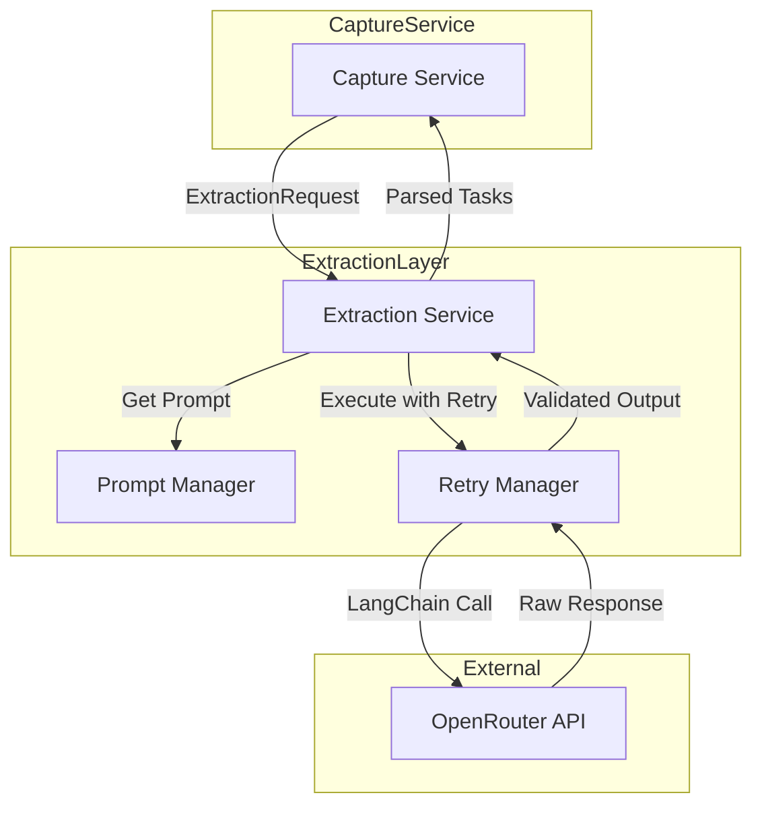

# Extraction Logic Refactoring Plan

## Overview
Refactor the extraction service to use LangChain with OpenRouter, implement a separate prompt management system, add JSON examples to prompts, include Pydantic validation with retry mechanism, and add support for multiple extraction models with A/B testing.

## Goals
1. Use LangChain with OpenRouter for structured extraction
2. Separate prompt management from extraction logic
3. Include JSON examples in prompts for consistent output format
4. Add Pydantic validation with retry mechanism
5. Prevent infinite retries to control token costs
6. Support multiple extraction models with A/B testing capabilities

## Architecture

### Component Diagram



## Implementation Details

### 1. Dependencies

Add to `backend/pyproject.toml`:
- `langchain>=0.3.0`
- `langchain-openai>=0.3.0` (for OpenRouter compatibility)
- `langchain-core>=0.3.0`
- `tenacity>=9.0.0` (for retry logic)
- `pyyaml>=6.0.0` (for model configuration)

### 2. Prompt Management (`backend/app/prompts/`)

Create a dedicated prompt management module:

**`backend/app/prompts/__init__.py`**
- Export prompt manager classes

**`backend/app/prompts/extraction_prompts.py`**
- Define `ExtractionPromptManager` class
- Include system prompt template
- Include user prompt template with dynamic variables
- Embed JSON example in the prompt

**Prompt Structure:**
```
System Prompt:
"You are a task extraction assistant for Gust. Extract actionable tasks from 
transcripts and return valid JSON matching the exact schema provided.

Example Output:
{
  \"tasks\": [
    {
      \"title\": \"Buy groceries\",
      \"due_date\": \"2026-03-25\",
      \"reminder_at\": \"2026-03-25T09:00:00\",
      \"group_id\": null,
      \"group_name\": \"Personal\",
      \"top_confidence\": 0.92,
      \"alternative_groups\": [],
      \"recurrence\": null,
      \"subtasks\": [
        {\"title\": \"Get milk\"},
        {\"title\": \"Get eggs\"}
      ]
    }
  ]
}"

User Prompt Template:
"User timezone: {timezone}
Current local date: {current_date}
Available groups:
{group_list}

Transcript:
{transcript_text}"
```

### 3. Pydantic Models (`backend/app/services/extraction_models.py`)

Create dedicated Pydantic models for extraction:

```python
class ExtractionAlternativeGroup(BaseModel):
    group_id: Optional[str] = None
    group_name: Optional[str] = None
    confidence: float = Field(ge=0.0, le=1.0)

class ExtractionRecurrence(BaseModel):
    frequency: Literal["daily", "weekly", "monthly"]
    weekday: Optional[int] = Field(None, ge=0, le=6)
    day_of_month: Optional[int] = Field(None, ge=1, le=31)

class ExtractionSubtask(BaseModel):
    title: str = Field(..., min_length=1)

class ExtractedTaskCandidate(BaseModel):
    title: str = Field(..., min_length=1)
    due_date: Optional[date] = None
    reminder_at: Optional[datetime] = None
    group_id: Optional[str] = None
    group_name: Optional[str] = None
    top_confidence: float = Field(ge=0.0, le=1.0)
    alternative_groups: list[ExtractionAlternativeGroup] = Field(default_factory=list)
    recurrence: Optional[ExtractionRecurrence] = None
    subtasks: list[ExtractionSubtask] = Field(default_factory=list)

class ExtractorPayload(BaseModel):
    tasks: list[ExtractedTaskCandidate]
```

### 4. Retry Mechanism (`backend/app/services/extraction_retry.py`)

Implement a retry manager with:
- Configurable max retries (default: 3)
- Exponential backoff between retries
- Pydantic validation on each attempt
- Cost tracking (token usage logging)
- Circuit breaker pattern to prevent runaway costs

```python
class RetryConfig:
    max_retries: int = 3
    base_delay: float = 1.0
    max_delay: float = 10.0
    exponential_base: float = 2.0

class ExtractionRetryManager:
    async def execute_with_retry(
        self,
        extraction_fn: Callable,
        validator: Callable,
        config: RetryConfig
    ) -> dict:
        # Implement retry logic with validation
```

### 5. Refactored Extraction Service (`backend/app/services/extraction.py`)

Replace the current `OpenRouterExtractionService` with LangChain-based implementation:

```python
from langchain_openai import ChatOpenAI
from langchain_core.prompts import ChatPromptTemplate
from langchain_core.output_parsers import JsonOutputParser

class LangChainExtractionService:
    def __init__(
        self,
        settings: Settings,
        prompt_manager: ExtractionPromptManager,
        retry_manager: ExtractionRetryManager
    ):
        self.settings = settings
        self.prompt_manager = prompt_manager
        self.retry_manager = retry_manager
        self.llm = self._create_llm()

    def _create_llm(self) -> ChatOpenAI:
        return ChatOpenAI(
            model=self.settings.openrouter_extraction_model,
            openai_api_key=self.settings.openrouter_api_key,
            openai_api_base=self.settings.openrouter_api_url.replace("/chat/completions", ""),
            temperature=0.0,
            max_retries=0,  # We handle retries ourselves
        )

    async def extract(
        self,
        *,
        request: ExtractionRequest,
        schema: dict[str, object],
    ) -> dict[str, object]:
        # Build prompts using prompt manager
        # Execute with retry manager
        # Return validated result
```

### 6. Settings Updates (`backend/app/core/settings.py`)

Add new configuration options:

```python
extraction_max_retries: int = Field(
    default=3,
    validation_alias=AliasChoices("EXTRACTION_MAX_RETRIES"),
)
extraction_retry_base_delay: float = Field(
    default=1.0,
    validation_alias=AliasChoices("EXTRACTION_RETRY_BASE_DELAY"),
)
extraction_retry_max_delay: float = Field(
    default=10.0,
    validation_alias=AliasChoices("EXTRACTION_RETRY_MAX_DELAY"),
)
```

### 7. Model Registry & A/B Testing (`backend/app/services/extraction_models.py`)

Create a model registry for managing multiple extraction models:

```python
from dataclasses import dataclass
from typing import Optional
import random

@dataclass
class ExtractionModelConfig:
    name: str
    model_id: str
    weight: float = 1.0  # For weighted A/B testing
    temperature: float = 0.0
    max_tokens: Optional[int] = None
    is_default: bool = False

class ExtractionModelRegistry:
    def __init__(self, configs: list[ExtractionModelConfig]):
        self.configs = configs
        self.default_config = next(
            (c for c in configs if c.is_default),
            configs[0] if configs else None
        )

    def select_model(self, user_id: Optional[str] = None) -> ExtractionModelConfig:
        """Select a model based on A/B testing strategy."""
        if not self.configs:
            raise ValueError("No extraction models configured")

        # If A/B testing disabled, return default
        if not self._ab_test_enabled:
            return self.default_config

        # Weighted random selection for A/B testing
        total_weight = sum(c.weight for c in self.configs)
        rand_val = random.uniform(0, total_weight)
        cumulative = 0.0

        for config in self.configs:
            cumulative += config.weight
            if rand_val <= cumulative:
                return config

        return self.default_config

    def get_config_by_name(self, name: str) -> Optional[ExtractionModelConfig]:
        """Get specific model config by name."""
        return next((c for c in self.configs if c.name == name), None)
```

### 8. Integration with Capture Service

Update `backend/app/services/capture.py`:
- Import new extraction models
- Wire in the new extraction service
- Remove redundant validation (now handled in extraction layer)
- Keep the existing retry count tracking for metrics
- Add model selection for A/B testing

## Key Design Decisions

### Retry Strategy
- **Max retries**: 3 attempts (configurable via env)
- **Backoff**: Exponential starting at 1s, capped at 10s
- **Validation failures**: Count toward retry limit
- **Provider errors**: Count toward retry limit
- **Token cost protection**: Log each retry with token count for monitoring

### Prompt Design
- JSON example embedded in system prompt
- Strict Pydantic validation after parsing
- Clear instructions to not invent new groups
- Confidence scoring guidance in prompt

### Error Handling
- Distinguish between validation errors (retryable) and config errors (not retryable)
- Log structured events for monitoring retry patterns
- Preserve original error context through the retry chain

### A/B Testing Strategy
- **Model Selection**: Weighted random selection based on configured weights
- **Default Model**: Always available as fallback
- **Configuration**: YAML file or environment variables for model configs
- **Metrics**: Track which model is used per extraction for analysis
- **User Consistency**: Optional user_id-based selection for consistent experience

## Migration Path

1. Create new modules (prompts, retry, models)
2. Implement new extraction service alongside existing one
3. Update capture service to use new extraction service
4. Remove old extraction service code
5. Run tests to validate behavior parity
6. Deploy and monitor retry metrics

## Testing Considerations

- Test retry behavior with mocked validation failures
- Test max retry limit enforcement
- Test exponential backoff timing
- Test token usage logging
- Test invalid JSON responses handling
- Test schema validation errors
- Test model selection with A/B testing
- Test weighted random distribution
- Test fallback to default model
- Test model configuration loading from YAML