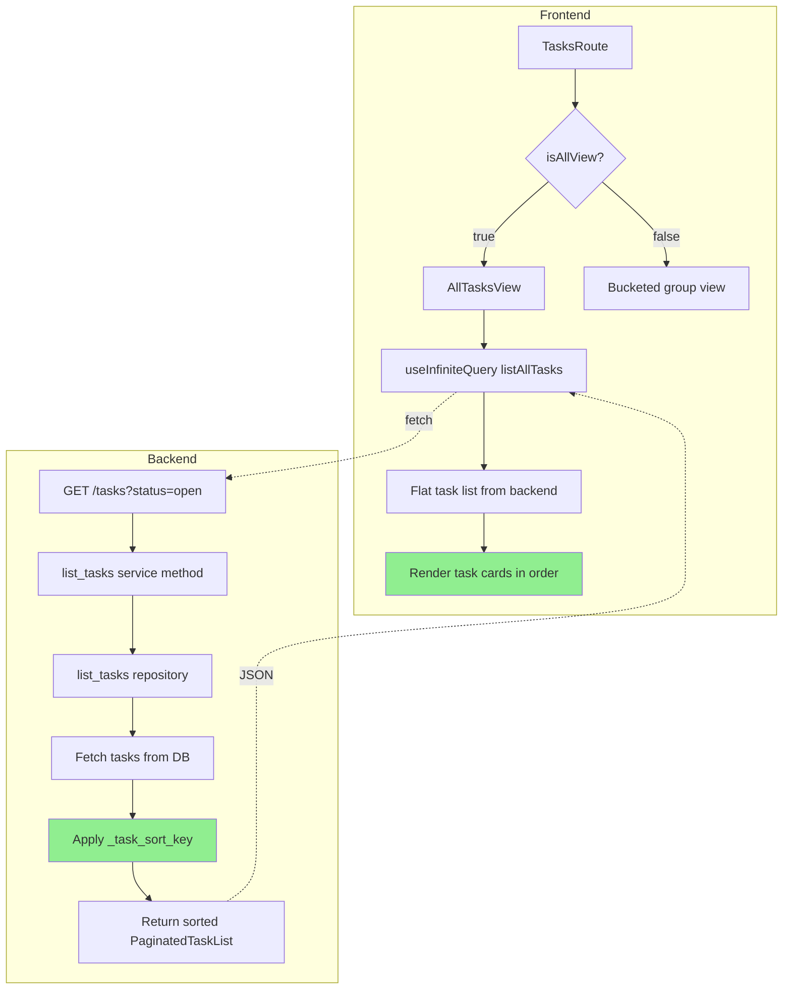

# Flat Tasks View Implementation Plan

**Date:** 2026-04-03  
**Objective:** Remove group-based organization from the All Tasks view and display a flat, sectioned list (`Today`, `Overdue`, `Others`) without changing the shared backend due-bucket contract used by grouped task views.

## Current State Analysis

### Backend Sorting Logic

The backend service layer should keep the existing grouped-view contract intact:
1. `due_bucket_for_date()` continues returning `overdue`, `due_soon`, `future`, or `no_date`
2. Per-group task lists continue to treat due-today tasks as part of `Due Soon`
3. Overdue tasks stay ahead of due-today tasks in grouped views

### Frontend AllTasksView Component

The current [`AllTasksView`](frontend/src/components/AllTasksView.tsx:44) component:
1. Fetches tasks via `useInfiniteQuery` using [`listAllTasks()`](frontend/src/lib/api.ts:307)
2. Groups tasks by `group_id` using a `Map`
3. Renders sections with sticky group headers
4. Maps over grouped tasks to render individual task cards

### Database Repository Layer

The [`list_tasks()`](backend/app/db/repositories.py:888) repository function:
1. Sorts by `created_at DESC, id DESC` at the SQL level (for cursor pagination)
2. Returns raw task records without due_bucket calculation
3. The service layer applies the actual business-logic sorting in Python

## Implementation Plan

### Phase 1: Frontend AllTasksView - Remove Group-Based Organization

**File:** [`frontend/src/components/AllTasksView.tsx`](frontend/src/components/AllTasksView.tsx)

**Changes:**

1. **Remove grouping logic** - Delete the `groupedTasks` useMemo block
2. **Add sectioning logic** - Derive `Today`, `Overdue`, and `Others` from `due_bucket` plus `due_date`
3. **Preserve group context** - Show each task's group label in collapsed all-groups cards
4. **Keep infinite scroll** - Preserve the IntersectionObserver-based pagination

**New component structure:**

```tsx
export function AllTasksView({
  onTaskOpen,
  onTaskPrepareOpen,
  onTaskComplete,
  onTaskDelete,
  busyTaskIds = [],
}: AllTasksViewProps) {
  const loadMoreRef = useRef<HTMLDivElement>(null)
  
  // Infinite query for paginated task fetching
  const allTasksQuery = useInfiniteQuery({
    queryKey: ALL_TASKS_INFINITE_QUERY_KEY,
    queryFn: ({ pageParam }) => listAllTasks('open', pageParam ?? null, PAGE_SIZE),
    initialPageParam: null as string | null,
    getNextPageParam: (lastPage) => lastPage.next_cursor,
  })
  
  // Flat list of tasks (already sorted by backend)
  const allTasks = allTasksQuery.data?.pages.flatMap((page) => page.items) ?? []
  const hasMore = Boolean(allTasksQuery.hasNextPage)

  const todayIsoDate = getTodayIsoDate(userTimezone)
  const sectionedTasks = useMemo(() => {
    const result = { today: [], overdue: [], others: [] }
    for (const task of allTasks) {
      if (task.due_bucket === 'overdue') {
        result.overdue.push(task)
      } else if (task.due_date === todayIsoDate) {
        result.today.push(task)
      } else {
        result.others.push(task)
      }
    }
    return result
  }, [allTasks, todayIsoDate])

  // Intersection Observer for infinite scroll
  useEffect(() => {
    // ... existing observer logic
  }, [allTasksQuery, hasMore])

  // Loading state
  if (allTasksQuery.isLoading && allTasks.length === 0) {
    return <LoadingState />
  }

  // Error state
  if (allTasksQuery.isError) {
    return <ErrorState error={allTasksQuery.error} />
  }

  // Empty state
  if (allTasks.length === 0) {
    return <EmptyState />
  }

  // Sectioned task list rendering
  return (
    <div className="space-y-6">
      {SECTIONS.map((section) => {
        const tasks = sectionedTasks[section.key]
        if (tasks.length === 0) return null
        return (
          <section key={section.key} className="space-y-3">
            <div className="flex items-center justify-between">
              <h3>{section.label}</h3>
              <span>{tasks.length} tasks</span>
            </div>
            <div className="space-y-2">
              {tasks.map((task) => (
                <TaskCard
                  key={task.id}
                  task={task}
                  onOpen={onTaskOpen}
                  onPrepareOpen={onTaskPrepareOpen}
                  onComplete={onTaskComplete}
                  onDelete={onTaskDelete}
                  isBusy={busyTaskIds.includes(task.id)}
                />
              ))}
            </div>
          </section>
        )
      })}

      {/* Load more trigger */}
      <div ref={loadMoreRef} className="h-4" />

      {/* Loading indicator */}
      {(allTasksQuery.isFetching || allTasksQuery.isFetchingNextPage) && (
        <div className="text-center text-sm text-on-surface-variant py-2">
          Loading more tasks...
        </div>
      )}

      {/* End of list indicator */}
      {!hasMore && allTasks.length > 0 && (
        <div className="text-center text-sm text-on-surface-variant py-2">
          All tasks loaded
        </div>
      )}
    </div>
  )
}
```

### Phase 2: Verify Integration

**No changes needed** to:
- [`TasksRoute.tsx`](frontend/src/routes/TasksRoute.tsx) - Already renders `AllTasksView` when `isAllView` is true
- [`listAllTasks()`](frontend/src/lib/api.ts:307) - Already calls the correct endpoint without `group_id`
- Backend route [`list_tasks_route()`](backend/app/api/routes/tasks.py:149) - Already supports optional `group_id`

## Mermaid Diagram



## Rollout Steps

1. **Backend sorting fix** - Update [`_task_sort_key()`](backend/app/services/task_service.py:937) to remove non-chronological factors
2. **Frontend refactor** - Simplify [`AllTasksView`](frontend/src/components/AllTasksView.tsx) to render flat list
3. **Manual testing** - Verify sorting order with various task scenarios:
   - Multiple overdue tasks (should be sorted by earliest due date)
   - Mix of overdue, upcoming, and no-date tasks
   - Tasks with same due date (should be sorted by creation time)
4. **Regression check** - Ensure group-specific views still work correctly

## Edge Cases

1. **Tasks with same due date** - Sorted by creation time (newer first) as tiebreaker
2. **Tasks without due dates** - Always appear at the bottom of the list
3. **Empty list** - Show appropriate empty state message
4. **Loading states** - Show skeleton/placeholder during initial load and pagination
5. **Error states** - Display error message if API call fails

## Confidence Assessment

**Confidence: 95%**

This plan is straightforward because:
- The backend already has the correct bucket classification (overdue, due_soon, no_date)
- The sorting logic is centralized in one method
- The frontend component is already fetching all tasks without group filtering
- The only changes needed are removing grouping logic and fixing the sort tuple

**Information that would increase confidence:**
- None - the codebase analysis is complete and the changes are well-scoped
