# Pending List Redesign: Final Plan

**Updated based on user feedback**

## User's Final Decisions

1. ✅ Keep all statuses in `extracted_tasks` table (pending, approved, discarded)
2. ✅ Modify cleanup job to only delete approved/discarded records, NOT pending
3. ✅ Pending tasks accumulate across captures and persist until user action
4. ✅ UI always shows pending tasks

---

## Critique of This Decision

### Pros

1. **Audit trail preserved** - Full history of extraction activity available for debugging and analysis
2. **Data for analytics** - Can analyze extraction success rates, common failures, user approval patterns
3. **Recoverability** - If a task is accidentally approved, you can see it was approved and restore from `tasks` table (soft reference)
4. **Simple mental model** - Status field makes sense and is documented

### Cons

1. **Slightly more complex cleanup** - Need to filter cleanup by status
2. **Larger table over time** - But as discussed, PostgreSQL handles millions of rows easily
3. **One extra field in queries** - Always need `WHERE status = 'pending'` filter

### Overall Assessment

**This is a good decision.** The audit trail benefit outweighs the marginal storage/complexity cost. The original concern about cleanup for pending tasks is addressed by your clarification.

---

## Final Design

### Schema Behavior

| Status | When Created | Cleanup |
|--------|-------------|---------|
| `pending` | On extraction | **Never** - persists until user action |
| `approved` | On user approve | After 7 days (via cleanup job) |
| `discarded` | On user discard | After 7 days (via cleanup job) |

### Cleanup Job Fix

**Current (wrong):**
```python
# Deletes ALL extracted_tasks after 7 days, including pending!
def delete_expired_extracted_tasks(connection, *, now, limit):
    cutoff = now - timedelta(days=7)
    rows = connection.execute(
        sa.select(extracted_tasks.c.id)
        .where(extracted_tasks.c.created_at <= cutoff)  # No status filter!
        ...
    )
```

**Fixed:**
```python
# Only deletes approved/discarded records, keeps pending forever
def delete_expired_extracted_tasks(connection, *, now, limit):
    cutoff = now - timedelta(days=7)
    rows = connection.execute(
        sa.select(extracted_tasks.c.id)
        .where(
            extracted_tasks.c.created_at <= cutoff,
            extracted_tasks.c.status.in_(['approved', 'discarded'])  # Skip pending!
        )
        ...
    )
```

### User Flow Changes

| Action | Behavior |
|--------|----------|
| Submit capture | Extract tasks, add to `extracted_tasks` with `status='pending'` |
| List pending tasks | `WHERE user_id = X AND status = 'pending'` - all captures |
| Approve task | Update status to `'approved'`, task already in `tasks` table |
| Discard task | Update status to `'discarded'` |
| Re-extract | Delete pending tasks for that capture, create new pending ones |
| "Done" button | Keep showing pending list - now persistent across all captures |

---

## Implementation Tasks

### Backend Changes

| # | Task | File | Changes |
|---|------|------|---------|
| 1 | Fix cleanup job | `repositories.py` | Add `status.in_(['approved', 'discarded'])` filter |
| 2 | Modify `list_extracted_tasks` | `repositories.py` | Add option to query by user_id only (no capture_id required) |
| 3 | Modify `approve_task` | `staging.py` | Update status to `'approved'` instead of deleting |
| 4 | Modify `discard_task` | `staging.py` | Update status to `'discarded'` instead of deleting |
| 5 | Add new endpoint | `captures.py` | `GET /pending-tasks` - list all pending for user without capture_id |
| 6 | Update `re_extract` | `staging.py` | Only delete pending records for that capture |
| 7 | Update docs | `database_schema.md` | Document that pending tasks are never auto-deleted |

### Frontend Changes

| # | Task | File | Changes |
|---|------|------|---------|
| 1 | Add `listPendingTasks` | `api.ts` | New function - list pending without capture_id |
| 2 | Update CaptureRoute | `CaptureRoute.tsx` | Always show pending list at bottom, accumulate across captures |
| 3 | Update StagingTable | `StagingTable.tsx` | Remove per-capture context, show source date for reference |
| 4 | Add "source" info | `ExtractedTaskCard.tsx` | Show which capture this came from (date/time) |

---

## No Schema Migration Needed

The table structure stays the same. Only:
1. Cleanup job behavior changes
2. Approve/discard behavior changes (update status vs delete)
3. Query behavior changes (user-scoped vs capture-scoped)

---

## Mermaid Diagram

```mermaid
graph TD
    A[Voice/Text Capture] --> B[Submit Transcript]
    B --> C[Extract Tasks]
    C --> D[Store in extracted_tasks<br/>status='pending']
    
    E[Another Capture] --> C
    
    D --> F[Pending List UI<br/>status='pending' only<br/>All captures, persistent]
    
    F --> G{User Decision}
    G -->|Approve| H[Update status='approved'<br/>Task already in tasks table]
    G -->|Discard| I[Update status='discarded']
    
    J[Cleanup Job] --> K[Only approved/discarded<br/>older than 7 days]
    K --> L[Delete records]
    
    style D fill:#1a1a1a
    style F fill:#2a2a2a
    style H fill:#1a4a1a
    style I fill:#4a4a1a
    style K fill:#3a3a3a
```



---

## Files to Modify

### Backend
- `backend/app/db/repositories.py` - fix cleanup filter, add user-scoped query
- `backend/app/services/staging.py` - update approve/discard to set status
- `backend/app/api/routes/captures.py` - add global pending endpoint
- `docs/database_schema.md` - document pending retention behavior

### Frontend
- `frontend/src/lib/api.ts` - add `listPendingTasks`
- `frontend/src/routes/CaptureRoute.tsx` - persistent pending list
- `frontend/src/components/StagingTable.tsx` - show source info
- `frontend/src/components/ExtractedTaskCard.tsx` - show capture context

---

## Confidence Assessment

**Confidence: 98%**

This decision is sound - preserves audit trail while keeping pending tasks visible until actioned. The cleanup job fix ensures pending tasks are never accidentally deleted.
