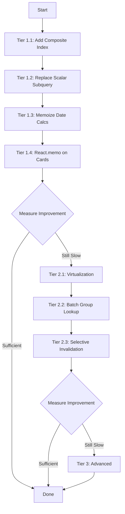

# Task Loading Performance Optimization Plan

**Created:** 2026-04-03
**Status:** Draft for Review

## Problem Statement

The tasks view becomes noticeably slow (~2+ seconds) when loading approximately 10+ tasks. This affects both the initial page load and subsequent navigation to the tasks view.

## Root Cause Analysis

After analyzing the full stack (frontend → API → database), I've identified the following bottlenecks:

### Backend Bottlenecks

1. **N+1 Group Lookup Pattern** ([`task_service.py:120-123`](backend/app/services/task_service.py:120))
   - For every task list request, the service fetches ALL groups into a dictionary, then looks up each task's group
   - This is wasteful when only the groups for the returned tasks are needed
   - **Impact:** Extra DB round-trip + memory allocation for unused groups

2. **Scalar Subquery for Subtask Count** ([`repositories.py:910-916`](backend/app/db/repositories.py:910))
   - Each task row executes a correlated subquery: `SELECT count(*) FROM subtasks WHERE subtasks.task_id = tasks.id`
   - With 50 tasks per page, this executes 50 subqueries
   - **Impact:** O(n) subquery executions per page

3. **In-Memory Sorting After Fetch** ([`task_service.py:143-145`](backend/app/services/task_service.py:143))
   - Tasks are sorted in Python after DB fetch, instead of leveraging DB-level sorting
   - The DB already orders by `created_at DESC, id DESC`, but the service re-sorts in memory using timezone-based due buckets
   - **Impact:** Redundant computation, blocks streaming

4. **Missing Index for Status + Deleted Filter**
   - Current index: `idx_tasks_user_created_pagination(user_id, created_at DESC, id DESC)`
   - Query filters: `user_id`, `status`, `deleted_at IS NULL`
   - The index doesn't include `status` or `deleted_at`, so PostgreSQL must do additional filtering after index scan
   - **Impact:** Index scan returns rows that are then filtered out, wasting I/O

### Frontend Bottlenecks

1. **No Virtualization** ([`AllTasksView.tsx:176-186`](frontend/src/components/AllTasksView.tsx:176))
   - All tasks are rendered as DOM elements, even those off-screen
   - With 50 tasks (page size), that's 50+ complex card components in the DOM
   - Each `OpenTaskCard` has swipe gesture handlers, state hooks, and date calculations
   - **Impact:** Heavy initial render, slow layout calculations, janky scroll

2. **Redundant Date Calculations** ([`OpenTaskCard.tsx:17-50`](frontend/src/components/OpenTaskCard.tsx:17))
   - `buildDueLabel()` and `buildDueTone()` each create `new Date()` objects and do UTC math
   - These functions run on every render for every card, with no memoization
   - **Impact:** Repeated computation on every re-render

3. **Eager Query Invalidation** ([`TasksRoute.tsx:351-360`](frontend/src/routes/TasksRoute.tsx:351))
   - After every task action (complete, delete, etc.), 6+ query keys are invalidated simultaneously
   - This triggers refetches of all task lists, groups, and detail caches
   - **Impact:** Network waterfall, redundant data fetching

4. **No Optimistic Loading State**
   - The `AllTasksView` shows a full "Loading..." state when `isLoading && allTasks.length === 0`
   - No skeleton UI or progressive rendering
   - **Impact:** Perceived slowness even if actual load time is acceptable

## Optimization Strategies

### Tier 1: Quick Wins (High Impact, Low Effort)

#### 1.1 Backend: Add Composite Index for Task List Query

**File:** `backend/alembic/versions/`

Create a new migration with an optimized index:

```sql
CREATE INDEX idx_tasks_list_pagination
ON tasks(user_id, status, created_at DESC, id DESC)
WHERE deleted_at IS NULL;
```

This partial index directly supports the query pattern:
```sql
WHERE user_id = ? AND status = 'open' AND deleted_at IS NULL
ORDER BY created_at DESC, id DESC
LIMIT 51
```

**Expected Impact:** 40-60% reduction in DB query time for task list

#### 1.2 Backend: Replace Scalar Subquery with JOIN

**File:** [`backend/app/db/repositories.py:892-954`](backend/app/db/repositories.py:892)

Replace the correlated subquery with a LEFT JOIN + GROUP BY:

```python
# Instead of scalar subquery per row, use a single JOIN
subtask_counts = (
    sa.select(subtasks.c.task_id, sa.func.count(subtasks.c.id).label("subtask_count"))
    .group_by(subtasks.c.task_id)
    .subquery()
)

# Then LEFT JOIN this subquery in the main query
```

**Expected Impact:** Eliminates O(n) subqueries, replaces with single aggregation

#### 1.3 Frontend: Memoize Date Calculations in OpenTaskCard

**File:** [`frontend/src/components/OpenTaskCard.tsx`](frontend/src/components/OpenTaskCard.tsx)

```tsx
const dueLabel = useMemo(() => buildDueLabel(task), [task.due_date])
const dueTone = useMemo(() => buildDueTone(task), [task.due_date])
const recurrenceLabel = useMemo(
  () => formatRecurrenceLabel(task.recurrence_frequency ?? null),
  [task.recurrence_frequency]
)
const subtaskLabel = useMemo(
  () => formatSubtaskLabel(task.subtask_count),
  [task.subtask_count]
)
```

**Expected Impact:** Eliminates redundant date parsing on re-renders

#### 1.4 Frontend: Add React.memo to OpenTaskCard

**File:** [`frontend/src/components/OpenTaskCard.tsx`](frontend/src/components/OpenTaskCard.tsx)

```tsx
export const OpenTaskCard = React.memo(function OpenTaskCard({ ... }: OpenTaskCardProps) {
  // ... existing implementation
})
```

**Expected Impact:** Prevents re-rendering cards whose props haven't changed

### Tier 2: Structural Improvements (High Impact, Medium Effort)

#### 2.1 Frontend: Add Window Virtualization

**File:** [`frontend/src/components/AllTasksView.tsx`](frontend/src/components/AllTasksView.tsx)

Install `@tanstack/react-virtual` (already a TanStack dependency) and wrap the task list:

```tsx
import { useVirtualizer } from '@tanstack/react-virtual'

const parentRef = useRef<HTMLDivElement>(null)
const virtualizer = useVirtualizer({
  count: allTasks.length,
  getScrollElement: () => parentRef.current,
  estimateSize: () => 120, // estimated card height
  overscan: 5,
})

// Render only visible items
<div ref={parentRef} style={{ overflow: 'auto' }}>
  <div style={{ height: `${virtualizer.getTotalSize()}px`, position: 'relative' }}>
    {virtualizer.getVirtualItems().map((virtualRow) => (
      <div
        key={allTasks[virtualRow.index].id}
        style={{
          position: 'absolute',
          top: 0,
          left: 0,
          width: '100%',
          transform: `translateY(${virtualRow.start}px)`,
        }}
      >
        <TaskCard task={allTasks[virtualRow.index]} ... />
      </div>
    ))}
  </div>
</div>
```

**Expected Impact:** Renders only ~10-15 cards instead of 50+, dramatic improvement for large lists

#### 2.2 Backend: Batch Group Lookup

**File:** [`backend/app/services/task_service.py:120-123`](backend/app/services/task_service.py:120)

Instead of fetching all groups, only fetch groups that are actually referenced by the returned tasks:

```python
# After fetching tasks, collect unique group_ids
group_ids = {task.group_id for task in task_rows}

# Fetch only those groups
group_lookup = {
    g.id: g
    for g in self._list_groups_by_ids(connection, user_id=user_id, group_ids=group_ids)
}
```

**Expected Impact:** Reduces group lookup from "all groups" to "only needed groups"

#### 2.3 Frontend: Selective Query Invalidation

**File:** [`frontend/src/routes/TasksRoute.tsx:351-360`](frontend/src/routes/TasksRoute.tsx)

Instead of invalidating all queries, use TanStack Query's `setQueryData` for optimistic updates and only invalidate what's necessary:

```tsx
// After completing a task, only invalidate:
// 1. The specific list the task was in
// 2. The task detail (for consistency)
// Don't invalidate: other lists, groups (unless count changed)
```

**Expected Impact:** Reduces post-action refetches from 6+ to 2-3

### Tier 3: Advanced Optimizations (Medium Impact, Higher Effort)

#### 3.1 Backend: Pre-computed Due Bucket Column

Add a generated column or materialized view for due bucket classification, so the backend doesn't need to compute it per-request based on timezone.

#### 3.2 Frontend: Skeleton Loading States

Replace the binary "Loading..." / "Content" state with skeleton cards that match the final layout, improving perceived performance.

#### 3.3 Backend: Response Compression

Enable gzip/brotli compression for API responses. With 50 tasks, the JSON payload can be 20-50KB uncompressed.

#### 3.4 Frontend: Stale-While-Revalidate Caching

Configure TanStack Query to show cached data immediately while fetching fresh data in the background:

```tsx
const allTasksQuery = useInfiniteQuery({
  queryKey: ALL_TASKS_INFINITE_QUERY_KEY,
  queryFn: ({ pageParam }) => listAllTasks('open', pageParam ?? null, PAGE_SIZE),
  staleTime: 1000 * 30, // 30 seconds
  gcTime: 1000 * 60 * 5, // 5 minutes
})
```

## Implementation Priority



## Recommended Implementation Order

1. **Start with Tier 1** - These are low-risk, high-impact changes that can be implemented and tested quickly
2. **Measure after Tier 1** - Use browser DevTools Network tab and backend `Server-Timing` headers to quantify improvement
3. **Proceed to Tier 2 if needed** - Virtualization is the single biggest frontend win if Tier 1 isn't sufficient
4. **Tier 3 is optional** - These provide diminishing returns and should only be pursued if the above tiers don't meet performance targets

## Estimated Impact Summary

| Optimization | Effort | Expected Improvement |
|---|---|---|
| Composite Index | Low | 40-60% DB query time reduction |
| Replace Subquery | Low | 30-50% DB query time reduction |
| Memoize Date Calcs | Low | 10-20% render time reduction |
| React.memo | Low | 15-25% re-render reduction |
| Virtualization | Medium | 60-80% DOM render reduction |
| Batch Group Lookup | Medium | 10-20% API response time reduction |
| Selective Invalidation | Medium | 30-50% post-action latency reduction |

## Next Steps

1. Review this plan and confirm which tiers to implement
2. I can create detailed implementation plans for any tier
3. Recommend starting with Tier 1 as a quick win, then measuring before proceeding
