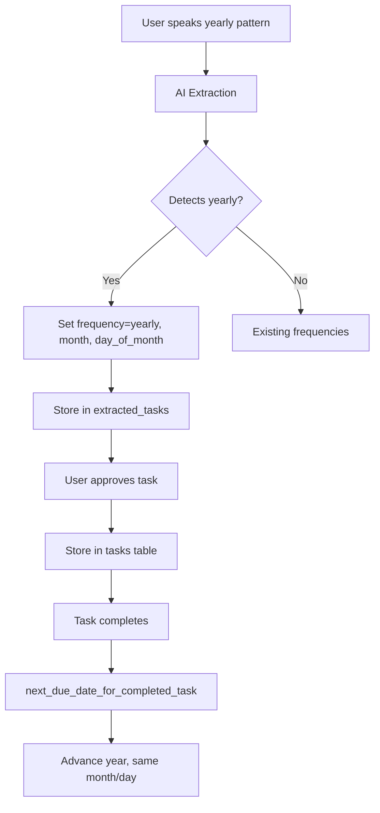

# Yearly Recurrence Implementation Plan

## Overview

Add "yearly" as a recurrence frequency option throughout the Gust application, enabling tasks to repeat annually on the same month and day (e.g., "pay taxes every April 15", "renew license every January 1", "birthday reminder every March 20").

## Current State

The system currently supports three recurrence frequencies:
- `daily` — repeats every day
- `weekly` — repeats on a specific weekday (0-6)
- `monthly` — repeats on a specific day of month (1-31)

Yearly recurrence will follow the same pattern as monthly, but track **month + day_of_month** and advance the year on completion.

## Architecture



## Changes Required

### 1. Database Schema Changes

**File:** [`backend/app/db/schema.py`](backend/app/db/schema.py:40)

Add `"yearly"` to the `recurrence_frequency` enum:

```python
recurrence_frequency = sa.Enum(
    "daily",
    "weekly",
    "monthly",
    "yearly",  # NEW
    name="recurrence_frequency",
    native_enum=False,
)
```

**File:** [`backend/app/db/schema.py`](backend/app/db/schema.py:129)

Update the `ck_tasks_recurrence_shape` check constraint to include yearly:

```python
# Add yearly case: frequency = 'yearly' AND recurrence_month IS NOT NULL AND recurrence_day_of_month IS NOT NULL
```

This requires adding a new column `recurrence_month` to the `tasks` table (SmallInteger, nullable).

**New Migration:** `backend/alembic/versions/0013_add_yearly_recurrence.py`

- Add `recurrence_month` column to `tasks` table
- Add `recurrence_month` column to `extracted_tasks` table
- Update `ck_tasks_recurrence_shape` constraint

### 2. Backend Service Changes

**File:** [`backend/app/services/task_rules.py`](backend/app/services/task_rules.py:18)

Update `RecurrenceInput` dataclass:
```python
@dataclass
class RecurrenceInput:
    frequency: str
    weekday: int | None = None
    day_of_month: int | None = None
    month: int | None = None  # NEW: for yearly recurrence
```

Update `NormalizedTaskFields`:
```python
@dataclass
class NormalizedTaskFields:
    # ... existing fields ...
    recurrence_month: int | None = None  # NEW
```

Update [`validate_recurrence()`](backend/app/services/task_rules.py:148):
```python
elif recurrence.frequency == "yearly":
    if (recurrence.month is not None and 1 <= recurrence.month <= 12 and
        recurrence.day_of_month is not None and 1 <= recurrence.day_of_month <= 31):
        if recurrence.weekday is None:
            return
```

Update [`next_due_date_for_completed_task()`](backend/app/services/task_rules.py:188):
```python
if recurrence_frequency == "yearly":
    if recurrence_month is None or recurrence_day_of_month is None:
        raise ValueError("Yearly recurrence requires month and day_of_month.")
    next_year = local_completed_date.year + 1
    last_day = calendar.monthrange(next_year, recurrence_month)[1]
    day = min(recurrence_day_of_month, last_day)
    return (date(next_year, recurrence_month, day), recurrence_day_of_month)
```

Update [`next_due_date_for_deleted_occurrence()`](backend/app/services/task_rules.py:216):
```python
if recurrence_frequency == "yearly":
    if recurrence_month is None or recurrence_day_of_month is None:
        raise ValueError("Yearly recurrence requires month and day_of_month.")
    next_year = occurrence_due_date.year + 1
    last_day = calendar.monthrange(next_year, recurrence_month)[1]
    day = min(recurrence_day_of_month, last_day)
    return (date(next_year, recurrence_month, day), recurrence_day_of_month)
```

**File:** [`backend/app/db/repositories.py`](backend/app/db/repositories.py)

Update all task creation/update functions to pass `recurrence_month`.

**File:** [`backend/app/services/extraction_models.py`](backend/app/services/extraction_models.py)

Update the recurrence model to accept `month` field:
```python
class RecurrencePayload(BaseModel):
    frequency: Literal["daily", "weekly", "monthly", "yearly"]
    weekday: int | None = None
    day_of_month: int | None = None
    month: int | None = None  # NEW: 1-12 for yearly
```

### 3. AI Extraction Prompt Changes

**File:** [`backend/app/prompts/extraction_prompts.py`](backend/app/prompts/extraction_prompts.py:293)

Update the JSON schema in the system prompt:
```json
"recurrence": "object {frequency: 'daily'|'weekly'|'monthly'|'yearly', weekday: 0-6, day_of_month: 1-31, month: 1-12} or null - NOTE: weekly/monthly/yearly recurrence REQUIRES due_date to be set"
```

Add examples for yearly patterns:
```
### Example: Yearly recurrence
---BEGIN TRANSCRIPT---
I need to file my taxes every year by April 15th
---END TRANSCRIPT---

PASS 2 OUTPUT:
```json
{
  "tasks": [
    {
      "title": "File taxes",
      "description": "Annual tax filing deadline.",
      "due_date": "2026-04-15",
      "recurrence": {"frequency": "yearly", "month": 4, "day_of_month": 15},
      "top_confidence": 0.9
    }
  ]
}
```
```

Add signal words for yearly detection in the prompt:
- "every year" → YEARLY
- "annually" → YEARLY
- "yearly" → YEARLY
- "each year" → YEARLY
- "every April" → YEARLY (with month=4)
- "every January 1st" → YEARLY (with month=1, day_of_month=1)

### 4. Frontend Changes

**File:** [`frontend/src/lib/api.ts`](frontend/src/lib/api.ts:50)

Update `TaskRecurrence` type:
```typescript
export type TaskRecurrence = {
  frequency: 'daily' | 'weekly' | 'monthly' | 'yearly'
  weekday: number | null
  day_of_month: number | null
  month: number | null  // NEW: 1-12 for yearly
}
```

Update `TaskSummary`:
```typescript
recurrence_frequency?: 'daily' | 'weekly' | 'monthly' | 'yearly' | null
```

Update `ExtractedTask`:
```typescript
recurrence_month: number | null  // NEW
```

**File:** [`frontend/src/components/TaskFormFields.tsx`](frontend/src/components/TaskFormFields.tsx:39)

Add yearly to FREQUENCIES:
```typescript
const FREQUENCIES = [
  { value: 'none', label: 'None' },
  { value: 'daily', label: 'Daily' },
  { value: 'weekly', label: 'Weekly' },
  { value: 'monthly', label: 'Monthly' },
  { value: 'yearly', label: 'Yearly' },  // NEW
]
```

Add yearly handler in `handleRecurrenceFrequencyChange`:
```typescript
else if (frequency === 'yearly') {
  if (dueDate) {
    const dateParts = dueDate.split('-')
    onRecurrenceChange({
      frequency: 'yearly',
      weekday: null,
      day_of_month: Number(dateParts[2] ?? 1),
      month: Number(dateParts[1] ?? 1),
    })
  } else {
    onRecurrenceChange({
      frequency: 'yearly',
      weekday: null,
      day_of_month: 1,
      month: 1,
    })
  }
}
```

Add yearly UI for month + day selection (similar to monthly but with month dropdown):
```typescript
{recurrenceFrequency === 'yearly' && (
  <div className="rounded-card bg-black/10 p-4">
    <p className="text-[0.68rem] font-semibold uppercase tracking-[0.16em] text-on-surface-variant">
      Month
    </p>
    <SelectDropdown
      label=""
      options={MONTHS}
      value={recurrenceMonth ?? ''}
      onChange={handleMonthChange}
      placeholder="Select a month"
      disabled={disabled}
    />
    <p className="mt-3 text-[0.68rem] font-semibold uppercase tracking-[0.16em] text-on-surface-variant">
      Day of Month
    </p>
    <input
      type="number"
      min={1}
      max={31}
      value={recurrenceDayOfMonth ?? ''}
      onChange={(e) => handleDayOfMonthChange(e.target.value)}
      className="mt-3 block w-full ..."
      placeholder="1-31"
      disabled={disabled}
    />
  </div>
)}
```

Add MONTHS constant:
```typescript
const MONTHS = [
  { value: '', label: 'Select a month' },
  { value: 1, label: 'January' },
  { value: 2, label: 'February' },
  // ... through December
  { value: 12, label: 'December' },
]
```

**File:** [`frontend/src/components/EditExtractedTaskModal.tsx`](frontend/src/components/EditExtractedTaskModal.tsx)

Update to handle `month` field in recurrence for extracted tasks.

### 5. Test Updates

**Backend tests:**
- [`backend/tests/test_tasks_groups.py`](backend/tests/test_tasks_groups.py) — add yearly recurrence test cases
- [`backend/tests/test_repositories.py`](backend/tests/test_repositories.py) — add yearly recurrence CRUD tests
- [`backend/tests/test_extraction_comprehensive.py`](backend/tests/test_extraction_comprehensive.py) — add yearly extraction tests

**Frontend tests:**
- [`frontend/src/test/tasks.test.tsx`](frontend/src/test/tasks.test.tsx) — add yearly recurrence UI tests
- [`frontend/src/test/extracted-task-card.test.tsx`](frontend/src/test/extracted-task-card.test.tsx) — add yearly display tests

## Implementation Order

1. **Database migration** — add `recurrence_month` column and update enum
2. **Backend validation** — update `task_rules.py` for yearly validation and next-date calculation
3. **Backend repositories** — pass `recurrence_month` through create/update paths
4. **Extraction models** — update Pydantic models for yearly
5. **Extraction prompts** — add yearly examples and signal words
6. **Frontend types** — update TypeScript types
7. **Frontend form** — add yearly option with month + day picker
8. **Frontend edit modal** — handle yearly in extracted task editing
9. **Tests** — add coverage for yearly recurrence throughout

## Edge Cases to Handle

1. **February 29** — If a task is set for Feb 29 and the next year is not a leap year, use Feb 28
2. **Month boundaries** — Ensure month is 1-12, day is 1-31 (validated per month)
3. **Existing tasks** — No migration needed for existing tasks; `recurrence_month` defaults to NULL
4. **AI extraction** — Handle ambiguous patterns like "every spring" (could map to month=3 or require clarification)

## Risk Assessment

| Risk | Likelihood | Impact | Mitigation |
|------|-----------|--------|------------|
| Leap year edge case | Medium | Low | Use `calendar.monthrange()` to get last day of month |
| AI misinterprets yearly | Low | Medium | Clear prompt examples, confidence scoring |
| Database migration failure | Low | High | Test migration on local stack first |
| Frontend type drift | Low | Medium | TypeScript strict mode catches mismatches |
